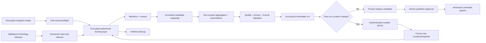

# COE — Corpus Ontology Enricher
### Production Design & Implementation Plan

| | |
|---|---|
| **Status** | Production-design draft with an implemented v0 alpha; protected production processing and publication remain gated by §15 |
| **Revision** | 2.0 |
| **Date** | 2026-07-16 |
| **Owner** | Gehad Sayed Ahmed |
| **Working name** | COE — *Corpus Ontology Enricher* (rename freely) |
| **Type** | Standalone system with its own runtime, database, artifact storage, API, UI, deployment, and operating procedures |
| **Dependency boundary** | No runtime or import dependency on an external clinical pipeline; approved reference data may be supplied through a versioned data contract |
| **Canonical v1 processing mode** | Immutable snapshot in → complete rebuild → validated run → curated, immutable release out |
| **Primary description** | A corpus-enriched clinical terminology and association graph, with optional curated local concepts |
| **Data classification** | Treat snapshots, working data, unreviewed lexical material, logs, backups, and unpublished artifacts as sensitive until an approved policy says otherwise |

---

## 1. Purpose, positioning, and production claim

COE ingests an approved snapshot of unstructured clinical notes and extracted document text, discovers clinically relevant lexical mentions, links them to pinned releases of external clinical terminologies, and produces a versioned corpus-level knowledge asset. The asset contains:

- external codings observed in the corpus;
- corpus-observed lexical forms and their reviewed mappings;
- run-scoped mention frequency and salience statistics;
- qualified empirical association observations;
- unmapped lexical candidates for review;
- optional, curator-created local COE concepts; and
- complete provenance tying every published claim to a snapshot, terminology release, algorithm/configuration version, immutable curation snapshot, and release.

COE is **not the first system to perform clinical concept extraction, entity linking, or ontology learning**. MetaMap, Apache cTAKES, MedCAT, scispaCy/UMLS, QuickUMLS, commercial clinical NLP systems, and ontology-learning research already cover much of that territory.

The defensible contribution is the combination of:

1. corpus-driven lexical enrichment computed over an approved snapshot;
2. deterministic-first, offline candidate generation and matching;
3. a strict guarantee that every returned external coding exists in the exact recorded terminology release;
4. explicit separation between **code validity** and **semantic mapping correctness**;
5. human curation with attributable, append-only decisions;
6. immutable, reproducible releases and controlled exports; and
7. an independently owned pipeline and corpus-derived layer. External terminology content remains owned and governed by its publishers and applicable licenses.

The first production artifact should be described as a **corpus-enriched clinical terminology and association graph**. The word *ontology* is appropriate for the product name, but must not be used to imply formal axioms, inferred taxonomy, clinical truth, or prevalence estimates that the system does not produce.

Prior systems may be used as a benchmark, but not as a code dependency. COE does not import an external resolver or knowledge-graph module.

### 1.1 Normative language

The words **MUST**, **MUST NOT**, **SHOULD**, **SHOULD NOT**, and **MAY** describe requirements. Requirements protecting confirmed sensitive-data publication, legal/license entitlement, external-code grounding, immutable history/audit, and release atomicity are non-waivable for production. Any other MUST exception is time-bounded, recorded in the decision log/audit trail, and approved by every affected domain owner—not architecture or security alone.

### 1.2 Core invariants

1. **No live clinical-source connectivity.** COE has no production database credentials or network path to production clinical databases or EMR write-back targets.
2. **No fabricated external coding.** Every emitted external `(system URI, code, release)` tuple exists in a validated reference release used by that run.
3. **Grounded is not verified.** Code existence proves validity of the target code, not correctness of the phrase-to-code mapping.
4. **Ambiguity is preserved.** Exact labels, aliases, abbreviations, and cross-system matches that have more than one plausible target are never silently resolved by index order.
5. **Raw text is disposable.** Raw documents, mention spans, and concordance context exist only in approved encrypted working/evidence storage and never in the durable published graph.
6. **Unaccepted and restricted content cannot be published.** Privacy, acceptance, quality, and license gates fail closed. `auto_accepted` is an approved immutable automated acceptance decision with policy provenance; it is not a pending item or a human-curated decision.
7. **Runs are immutable and reproducible given the same approved inputs.** A successful run's identities, algorithms, facts, and content digest never change. After source-content retention ends, the run remains auditable and its frozen artifacts remain reproducible from release tables, but the source analysis cannot be re-executed unless the sealed snapshot is supplied again.
8. **Curation is append-only.** Decisions do not rewrite historical evidence or past releases.
9. **Publication is atomic.** A failed run or failed publication cannot alter the current published release.
10. **Association is not semantics.** Co-occurrence is an observed statistic, not equivalence, causation, hierarchy, or a clinical relationship.
11. **Public identifiers are stable.** Database sequence IDs are internal and never become public concept identity.
12. **Mention frequency is not prevalence.** COE describes mentions in documents, not patient counts, diagnoses, or clinical outcomes.

---

## 2. Product contract

### 2.1 Primary users and first supported workflows

The v1 production system serves:

- **Clinical terminology curators** who review ambiguous mappings, observed lexical forms, empirical associations, and candidate terms.
- **Publishers/release approvers** who approve a validated run and its immutable curation snapshot for controlled release.
- **Internal analysts and services** that consume versioned JSONL, CSV, RDF, or approved FHIR terminology artifacts.
- **Operators** who perform intake, runs, validation, publication, rollback, backup, restore, and incident response.

Supported v1 workflows are:

1. Receive and validate an approved, immutable corpus snapshot.
2. Mine lexical mentions and qualify them by context.
3. Generate and rank grounded terminology candidates without fabricating codes.
4. Aggregate mention statistics without retaining patient-level records.
5. Review ambiguous mappings, lexical forms, candidate terms, and selected associations.
6. Create a local COE concept only through an explicit curated workflow.
7. Publish an immutable, license-aware release with machine-readable provenance and checksums.
8. Roll back an audience/profile publication-channel pointer without rewriting history.

The Phase 0 product owner MUST name the first downstream consumer and the first query or decision the asset must support. That decision determines the initial note types, terminology systems, and release profile. The production architecture supports all seven reference systems, but the thin vertical slice SHOULD begin with one note type and one or two systems selected for the first use case.

### 2.2 Safety and use limitations

COE v1 is not authorized for:

- autonomous diagnosis, treatment, triage, or clinical decision support;
- automated billing or production coding;
- patient-level prevalence or outcome measurement;
- automatic changes to an EMR, terminology server, or source clinical system;
- public redistribution of terminology content or corpus-derived labels without an approved license/export profile; or
- presenting pending, fuzzy, embedding, or ambiguous mappings as accepted or authoritatively sourced.

Every UI and exported release manifest MUST state the applicable limitations.

### 2.3 Initial production success criteria

A release is successful only when all of the following are true:

- the grounding invariant is 100%;
- no sensitive canary or confirmed direct identifier reaches a published artifact;
- every enabled terminology has a validated release and approved license/export policy;
- clinical-quality gates in §13.3 pass on the frozen held-out set;
- deterministic, privacy, authorization, crash-recovery, export, backup/restore, and performance gates pass;
- the run and exact curation-state snapshot are immutable and traceable;
- the release can be withdrawn or rolled back without database surgery; and
- named product, clinical, privacy, security, terminology-license, and operations owners approve go-live.

---

## 3. Goals and non-goals

### 3.1 Goals for the first production release

1. Ingest an immutable, approved corpus snapshot without connecting to a live source system.
2. Validate snapshot integrity and de-identification status before any mining begins.
3. Extract mention candidates using terminology labels, n-grams, collocations, and linguistic spans.
4. Preserve temporary span context for assertion, experiencer, temporality, section, semantic type, and ambiguity resolution.
5. Map mentions to pinned terminology releases using a deterministic-first, grounding-safe matcher.
6. Retain ranked alternatives and abstain when evidence is insufficient.
7. Produce four controlled enrichment outputs:
   - reviewed lexical forms;
   - run-scoped frequency and salience metrics;
   - qualified association observations; and
   - candidate terms, some of which may become curated local concepts.
8. Persist stable semantic identities separately from run evidence and curator decisions.
9. Publish immutable, reproducible, privacy-checked, license-aware releases.
10. Provide an authenticated curation and publication interface with attributable audit logging.
11. Export JSONL and CSV; provide standards-aware RDF/SKOS/PROV and approved FHIR terminology artifacts.
12. Operate with monitored security, backups, rollback, runbooks, resource limits, and defined owners.

### 3.2 Explicit non-goals for v1

- **No live or streaming ingest.** Growing data creates a new sealed snapshot and a complete new run.
- **No patient graph.** An optional opaque subject-group key may be used transiently for de-duplication/privacy statistics, but is not a graph node or export field.
- **No patient prevalence claim.** Frequencies are document/mention statistics.
- **No inferred hierarchy.** Hierarchy is imported only from an authoritative, versioned relationship source or created through an approved local curation policy.
- **No lexical cross-system equivalence.** Cross-system mappings require an authoritative cross-map or curator decision.
- **No generative or LLM extraction in v1.** Statistical NLP taggers/parsers used for segmentation or noun chunks and any optional embedding reranker are pinned, fingerprinted, and independently evaluated; none may generate an external code.
- **No automatic publication of fuzzy or embedding matches.** They remain review-required in v1.
- **No multi-annotator production adjudication workflow.** A second reviewer is still required for a subset of the evaluation gold set and a separate publisher approves releases.
- **No public terminology mirror.** COE does not republish external code systems as its own.
- **No direct UI writes to Postgres.** Mutations go through the authenticated service layer.

---

## 4. Inputs, contracts, and governance

### 4.1 Corpus snapshot contract

The source is an approved extract of clinical notes and document text. The current expected scale is approximately 3,000 documents, but all limits are configurable and guarded.

An intake bundle contains:

```text
snapshot_<snapshot-id>/
├── snapshot_manifest.json
├── documents.jsonl
├── documents/<opaque-doc-id>.txt
├── deidentification_attestation.json
└── checksums.sha256
```

`snapshot_manifest.json` MUST include:

- `manifest_schema_version`;
- globally unique `snapshot_id` and immutable snapshot IRI;
- UTC creation timestamp and approved source environment classification;
- document count, total bytes/characters, note-type summary, language summary, and extraction/OCR summary;
- content-set SHA-256 and hash of each companion manifest;
- upstream extractor, de-identification profile, and attestation versions;
- privacy owner/approval reference and retention policy identifier; and
- parent snapshot ID when this snapshot supersedes an earlier full snapshot.

`documents.jsonl` uses opaque identifiers and MUST include:

- `doc_id`, relative file path, SHA-256, byte/character count, note type, language, and extraction method;
- optional opaque subject-group ID only when approved for duplicate detection or distinct-subject privacy thresholds; and
- no names, MRNs, DOBs, raw source keys, identifiers embedded in filenames, or unnecessary `source_ref` values.

Snapshot intake requirements:

1. Transfer through an approved encrypted intake location.
2. Mount or expose source content read-only to the worker.
3. Reconcile every manifest entry, file, size, and hash; reject missing or extra files.
4. Reject duplicate IDs, unsupported encodings, identifier-bearing filenames, schema drift, and high-confidence sensitive findings.
5. Detect exact and near-duplicate documents and repeated templates before frequency calculations.
6. Record an immutable snapshot row only after preflight passes.
7. Delete source and working content according to the approved retention policy after the final curation/rebuild window.

Snapshot hashing is canonical and non-circular. Normalize relative paths to Unicode NFC POSIX form, reject absolute paths, `..`, case-colliding names, and duplicate normalized paths, then sort by normalized path. Compute `content_set_sha256` over UTF-8 bytes of the RFC 8785 JSON Canonicalization Scheme (JCS) representation containing the schema version plus `{path, byte_count, sha256}` for every document and the hashes of `documents.jsonl` and `deidentification_attestation.json`. JCS fixes key ordering, number/string serialization, escaping, and separators. `snapshot_manifest.json` and the derived convenience file `checksums.sha256` are excluded from that root calculation; the completed manifest is hashed separately. The run fingerprint uses only `content_set_sha256` as the snapshot-content identity.

COE's secondary scrub and frequency thresholds are defense-in-depth. They are **not** a legal or statistical de-identification method. The upstream data owner must document the selected approved method and residual-risk decision. HHS guidance recognizes Safe Harbor and Expert Determination as separate approaches; applicability and approval must be determined by the data owner's privacy and legal owner.

### 4.2 Terminology reference contract

The currently available normalized reference bundle is:

| System | Approximate rows |
|---|---:|
| SNOMED CT | 386,110 |
| LOINC | 109,325 |
| ICD-10-PCS | 79,193 |
| RxNorm | 81,397 |
| ICD-10-CM | 74,703 |
| CPT | 12,665 |
| HCPCS | 9,068 |

The row counts are release observations, not permanent constants. Each enabled vocabulary MUST have an immutable `terminology_release_manifest.json` containing:

- canonical system URI, system name, publisher, release/version, effective date, language, and source URI;
- source SHA-256, file size, schema version, exact or approved bounded row count, and expected code-format rules;
- active/inactive-code policy and relationship-file policy;
- license/entitlement owner, approval reference, permitted environments/users, expiry or review date;
- allowed derived uses and export fields for each export profile; and
- required copyright, attribution, or third-party notices.

The canonical import model separates:

- stable coding identity: `system_uri + code`;
- release-specific display, definition, active status, semantic type, and properties;
- designations/aliases with language, kind, source, and release; and
- optional relationship files with explicit predicate, endpoint, active status, and release.

The existing flattened CSVs may be accepted through an adapter, but pipe-delimited aliases are converted to separate designation rows. A flattened CSV without relationships does **not** authorize hierarchy output.

Reference files MUST NOT be committed to Git or embedded in a generally distributable container image. Production mounts an approved release read-only and builds a derived index keyed by the source hash and normalizer version. Any workstation source directory is a private development input and MUST NOT be recorded in distributable artifacts.

Preflight MUST reject:

- Git-LFS pointer signatures;
- missing, truncated, modified, expired, or unapproved releases;
- checksum, schema, release identity, or row-count mismatch;
- duplicate codes or invalid required fields;
- invalid relationship endpoints; and
- terminology use not permitted by the recorded analysis-use entitlement. Destination/export permission is evaluated separately when an artifact set is prepared.

### 4.3 Configuration contract

All behavior that can change analysis or publication semantics is explicit, versioned, schema-validated, and included in either the analysis run fingerprint or the artifact-set digest as specified:

- enabled terminology releases and candidate-generation priorities;
- note types and languages;
- tokenization, normalization, abbreviation, assertion, and semantic-type profiles;
- phrase length, support, tf-idf, collocation, ambiguity, and association thresholds;
- canonical analysis-target policy;
- auto-acceptance policy;
- privacy scan/de-identification profile;
- terminology-use entitlement identity (part of analysis semantics); and
- destination/export profile identity (part of an artifact-set digest, not the analysis run fingerprint); and
- algorithm/model versions and random seeds.

Secrets are supplied through the approved secret manager and never enter run parameters, configuration files, logs, or exported manifests.

---

## 5. Architecture and data flow



### 5.1 Production services

COE consists of separately permissioned components:

- **Batch worker/CLI** — preflight, reference-index build, run orchestration, validation, cleanup, and export generation.
- **Curation/publication API** — authenticated, authorized service layer for reads and state changes.
- **Streamlit UI** — thin user interface calling the API; it has no broad direct database write credentials.
- **PostgreSQL 16** — private, durable reference metadata, stable identities, run evidence, curation events, and frozen releases.
- **Encrypted artifact storage** — distinct `intake`, `quarantine`, `validated`, `evidence`, and `published` zones with separate permissions and retention.
- **Ephemeral encrypted working storage** — raw text, token streams, spans, and temporary candidate evidence; excluded from durable backups.
- **Identity-aware proxy** — TLS plus individual SSO/OIDC identities and MFA.
- **Protected audit/observability destinations** — structured logs, metrics, alerts, and immutable audit copies without document text.

### 5.2 CLI/API surface

Required operator commands:

```text
coe preflight snapshot <path>
coe reference validate <manifest>
coe reference build-index <release-id>
coe run create --snapshot <id> --config <file> --curation-snapshot <id>
coe run status <run-id>
coe run cancel <run-id>
coe run validate <run-id>
coe curation snapshot create
coe release prepare <run-id> --curation-snapshot <snapshot-id>
coe artifact-set prepare <release-id> --profile <profile>
coe release publish --artifact-set <id> --channel <name> --profile <profile> --expected-current <id-or-none>
coe release rollback --channel <name> --profile <profile> --to-artifact-set <id> --expected-current <id>
coe export <artifact-set-id>
coe cleanup <run-id>
coe stats <run-or-release-id>
```

All commands return documented exit codes and a machine-readable result option. Destructive or publication actions require explicit authorization and are idempotent.

### 5.3 Run lifecycle

V1 uses full-snapshot rebuilds. It never incrementally adds counts to an old run.

The logical run key is:

```text
sha256(
  content_set_sha256
  + ordered_terminology_release_hashes
  + canonical_config_hash
  + code/container identity
  + algorithm/model/normalizer versions
  + curation_snapshot_hash
)
```

Computation states are:

`created → preflight → normalizing → mining → contextualizing → matching → aggregating → validating → succeeded`

Any active state may become `failed` or `cancelled`. Publication and cleanup are tracked separately:

- publication: `unpublished | release_candidate | published | superseded | withdrawn`;
- cleanup: `pending | complete | failed`.

Rules:

1. Acquire a database advisory lock on the logical run key.
2. Return the existing successful result when the same logical run is requested again.
3. Record each operational retry as a separate `RunAttempt` without creating duplicate facts.
4. Write raw/token/span data only to temporary process memory or the restricted ephemeral work store.
5. Promote validated run facts in one transaction and set `succeeded` last.
6. UI and export queries read only successful runs or frozen releases.
7. Failed attempts record sanitized error codes without raw text and cannot affect the current release.
8. A change to snapshot, terminology, configuration, code, algorithm, model, or curation snapshot creates a different logical run.
9. Curation never mutates old run facts. Any post-run human curation decision that changes mapping acceptance, canonical target selection, context qualification, node identity, counts, labels, or associations requires a new immutable `CurationSnapshot` and a new analysis run.
10. Publication freezes release membership/artifacts and atomically advances the selected audience/profile publication-channel pointer.

A `CurationSnapshot` is created under a serializable transaction or global snapshot lock. It records the exact set/current-state digest used by analysis; a highest sequence number alone is insufficient because concurrent events may allocate sequence values in a different order from transaction commit. The first run uses an explicit immutable empty/genesis curation snapshot. `coe run create` never defaults to "latest." A published release MUST reference the same curation-snapshot ID/hash as its source run. Later curation cannot be included in that release without a new analysis run.

After snapshot content is purged, COE records the purge timestamp and retains manifests, hashes, run facts, validation reports, curation events, and frozen release content. It must then describe the run as **auditable from retained provenance**, not as independently re-executable from source.

---

## 6. NLP, mention extraction, and matching

### 6.1 Ingest and reversible normalization (`coe/ingest/`)

`snapshot.py` validates and streams the approved snapshot into `Document` records. Raw text is not written to durable application tables.

Normalization is ordered, versioned, terminology-aware, and reversible:

1. Unicode and whitespace canonicalization.
2. Sentence/section segmentation and tokenization.
3. Conservative case-folded lexical form.
4. Optional punctuation and morphological variants for candidate generation.
5. Curated spelling and abbreviation variants with provenance.

Primary exact matching occurs before lossy transforms. Lemmatization, punctuation removal, and abbreviation expansion are candidate-generation operations, not destructive rewrites.

Normalization MUST preserve or explicitly model clinically meaningful distinctions including:

- case-sensitive acronyms;
- decimals, plus/minus notation, strengths, units, routes, and dosage forms;
- laterality and anatomic qualifiers;
- hyphenated and alphanumeric terms;
- terminology-specific component structure; and
- the original surface text and the ordered transformation trace while the working record exists.

### 6.2 Phrase and span mining (`coe/mining/`)

Candidate spans are the union of:

- direct terminology label/alias spans from a trie or equivalent index;
- token n-grams, default `n=1..4` and configurable to 8 with hard limits;
- noun chunks and terminology-aware linguistic spans;
- PMI, normalized PMI, c-value, and/or log-likelihood collocations; and
- curator-approved abbreviation and spelling patterns.

For each occurrence, the temporary layer records:

```text
doc_id, note_type, section, sentence_id, span_start, span_end,
surface_text, normalization_trace, extraction_method,
semantic_type_candidates, assertion, experiencer, temporality
```

Mining requirements:

- never form n-grams across sentence boundaries;
- detect templates/near-duplicates so repeated boilerplate cannot dominate counts;
- resolve overlapping spans before counting, preferring the longest semantically valid mention while retaining nested spans only when they express distinct concepts;
- cap candidates and pair generation per document to prevent resource exhaustion;
- calculate raw occurrence count, document frequency, optional distinct-subject frequency, and note-type breakdown separately;
- keep prevalence/frequency and distinctiveness/salience as separate metrics; and
- define the tf-idf roll-up formula and denominator in a versioned metric specification.

The default candidate-retention support may start at `doc_freq >= 3`, but this is a noise/queue-size setting—not a privacy guarantee. Published association edges require stronger support (§6.6).

### 6.3 Mention context (`coe/context/`)

Phrase discovery does not establish a clinical assertion. COE qualifies each occurrence before aggregation with controlled values:

- `assertion`: `affirmed | negated | possible | conditional | unknown`;
- `experiencer`: `patient | family | other | unknown`;
- `temporality`: `current | historical | planned | unknown`; and
- `section`: controlled or normalized note section when available.

Default current-clinical-mention statistics use only `affirmed + patient + current` mentions. An explicitly labeled all-context mention count may also be published. Historical, planned, possible, negated, unknown, and non-patient mentions remain separate aggregate dimensions rather than being silently mixed into current positive evidence.

The system may use deterministic rule-based context handling first. Any learned context model must be pinned, evaluated independently, and included in the run fingerprint.

### 6.4 Terminology indexes (`coe/terminology/reference.py`)

Each reference index is built once per `(terminology release hash, index schema version, normalizer version)` and stored as a validated, read-only artifact. Do not use unsafe untrusted pickle deserialization.

Required indexes:

- `system_uri + code → coding version` for direct code validation;
- `normalized preferred label/alias → list[coding version]` for exact candidate generation;
- token/postings index for fuzzy candidate generation; and
- semantic type/status metadata for routing and filtering.

The implementation may use SQLite FTS, compact postings, memory mapping, or another measured representation. Phase 1 benchmarks cold build time, warm load time, peak RSS, artifact size, and candidate latency before the final choice is frozen.

### 6.5 Candidate generation, ambiguity, and mapping (`coe/terminology/matcher.py`)

Every matcher layer returns a ranked candidate set. No layer selects the first record returned by an index.

Candidate layers are:

1. **Code lookup** — only when the input explicitly has a code/system form.
2. **Exact preferred-label match.**
3. **Exact alias/designation match.**
4. **Conservative normalized lexical variants.**
5. **Fuzzy lexical candidates** from bounded postings, scored with defined token and edit-distance components.
6. **Optional embedding rerank** over an already grounded candidate set; it cannot create a coding.

Vocabulary routing changes retrieval priority only. It never establishes identity or permits one system's candidate to overwrite another. Different terminologies serve different purposes and retain separate results.

Occurrence-level `OccurrenceCandidateEvidence` remains in the TTL-bound `work`/`quarantine` boundary and records:

```text
ephemeral_mention_id, target_system_uri, target_code, target_release,
method, normalizer_version, lexical_score, contextual_score,
semantic_type_score, rank, ambiguity_margin, algorithmic_outcome,
run_id
```

Occurrence evidence and mention IDs are deleted with source context. Durable `MappingCandidateAggregate` rows exist only for privacy-cleared lexical propositions/scopes and contain `run_id`, durable lexical assertion/scope ID, target coding/release, method/version, support counts, score summaries, rank/ambiguity summary, algorithmic outcome, and a privacy-cleared aggregate evidence summary. They contain no document ID, mention ID, span, snippet, patient/subject key, or reference to an expiring candidate record.

Algorithmic outcomes are:

`grounded_unique | grounded_ambiguous`

`unmapped` and `blocked_sensitive` are lexical/candidate outcomes with no target and therefore are not mapping rows. Acceptance is separate from candidate evidence. The effective state is `pending | auto_accepted | curator_accepted | curator_rejected | superseded`; provenance identifies authoritative source mappings, and the ambiguous word `verified` is not a database status. Numeric outputs are called **scores** unless calibration demonstrates probability semantics.

`auto_accepted` is an immutable run-scoped `AutomatedAcceptanceDecision` produced by a named, versioned policy included in the run fingerprint, and only after that policy has passed its release gates. Human curation is append-only and can override it in a later `CurationSnapshot`, which then requires a new run. Fuzzy/embedding candidates cannot enter automated acceptance in v1.

Automatic acceptance is allowed only when:

- the candidate is unique after system, active-status, semantic-type, and context constraints;
- the form is not a high-risk abbreviation, known homonym, or normalization collision;
- no competing candidate is inside the configured ambiguity margin;
- the mapping policy has passed the held-out auto-acceptance precision gate; and
- privacy and license policies allow the resulting lexical form and coding.

Fuzzy and embedding candidates remain review-required in v1. Abbreviation expansion is many-to-many and context-sensitive; every expansion has a source/version. `MI → myocardial infarction` can be a candidate, never an automatic verification merely because the expansion exists.

Durable semantic propositions are split:

- `LexicalMappingAssertion` states that a language-qualified lexical form denotes a node under a durable `MappingScope`. The scope records sense-cluster ID, semantic type, applicability (`global | scoped`), and any note-type, section, assertion, experiencer, or temporal constraints. A scoped decision cannot be reused outside that scope.
- `ConceptMappingAssertion` relates one concept node to another across schemes. Its source, target, direction, authority/curator provenance, and relation are explicit.

Run evidence never embeds mutable decision state or a single curator-event pointer. Curation events attach to a stable proposition/subject and may accept, reject, reopen, or supersede it without changing the original algorithmic evidence.

### 6.6 Aggregation and association observations (`coe/enrich/`)

Run aggregation produces:

- lexical metrics by context, note type, and match outcome;
- concept/coding metrics by context and mapping decision;
- accepted lexical-form observations;
- candidate-term queue items in restricted storage; and
- association observations.

The canonical analysis-target policy selects at most one counted target per mention for a given analysis graph. Ranked alternates and mappings into other systems remain evidence but are not double-counted as separate mentions. Association graphs are generated within an explicitly named scheme or local-concept layer; cross-system semantic edges are never inferred from co-mention. Only context-eligible mentions whose effective mapping state—combining the run's automated decisions with its exact `CurationSnapshot`—is `auto_accepted` or `curator_accepted` may contribute to a published association. Pending, grounded-only, ambiguous, fuzzy-review, rejected, superseded, and sensitive outcomes do not create publishable edges.

Association requirements:

- sentence/section/window scope is evaluated before document scope;
- document-scope results are labeled as such and controlled for note length/templates;
- store co-occurrence count, opportunity/denominator count, scope, PMI, normalized PMI, optional log-likelihood, method version, run, and note-type stratum;
- require minimum document support of 10 for publication unless a stricter approved profile applies;
- suppress unstable or privacy-sensitive edges;
- bootstrap the top-edge set and enforce the stability gate in §13.3; and
- use a custom empirical relation/qualified observation, never `IS-A`, equivalence, causation, or automatic `skos:related`.

### 6.7 Candidate terms and local concepts

An unmapped phrase is a `CandidateTerm`, not proof of a new clinical concept. It may be a missing alias, spelling variant, compositional phrase, shorthand, unsupported release, ambiguity, extraction noise, sensitive value, or genuine local concept.

Candidate terms are stored in a restricted queue with:

```text
surface digest/display under approved policy, normalized variants, language,
semantic type candidates, context cluster, corpus/doc frequency,
note-type breakdown, first-seen snapshot/run, evidence summary, review state
```

Normalized text is not globally unique because the same lexical form can represent multiple senses.

Review outcomes are:

- `mapped_existing`;
- `created_local_concept`;
- `merged`;
- `split`;
- `rejected_noise`;
- `rejected_sensitive`; or
- `deferred`.

Creating a local concept requires a stable IRI, preferred label, definition, semantic type, scope note, creator, timestamp, lifecycle state, source snapshot/run identity, privacy-cleared aggregate evidence summary, support counts, and an evidence-retention reference/status. Ephemeral concordance alone is insufficient long-term provenance. Activation/publication additionally requires a verified evidence-deletion receipt/tombstone after cleanup. Local-concept revisions, merges, splits, deprecations, and replacements are append-only.

A local concept may receive curated cross-scheme `exactMatch | closeMatch | broadMatch | narrowMatch | relatedMatch` assertions to external codings; lexical similarity alone cannot create them. The local concept is the source and the external coding is the target. `broadMatch` means the target is broader than the source; `narrowMatch` means the target is narrower. Reserve `broader | narrower` for hierarchy inside one concept scheme.

### 6.8 Hierarchy policy

V1 does not infer hierarchy from co-occurrence, code formatting, lexical similarity, or search order.

External hierarchy is imported only from an authoritative, versioned relationship dataset. Every edge records source terminology, relationship type, release, active status, and provenance. If the input release contains only the flattened CSV contract, COE emits no external hierarchy.

Curated broader/narrower relations for local concepts require an approved relation policy and release review. Co-occurrence is never hierarchy.

---

## 7. Representation and persistence

### 7.1 Storage and PostgreSQL boundaries

Only durable, privacy-cleared or non-textual state belongs in the backed-up PostgreSQL cluster. Storage lifecycle boundaries are:

| Boundary | Purpose | Location and persistence |
|---|---|---|
| `ref` | Terminology systems, immutable releases, codings, release-specific labels/properties/relations | Durable PostgreSQL; append-only after validation |
| `core` | Stable coding/local-concept nodes, local revisions, privacy-cleared lexical identities | Durable PostgreSQL; stable identity/revisions append-only |
| `analysis` | Snapshots, logical runs/attempts, run-scoped metrics, mapping evidence, associations | Durable PostgreSQL; successful runs immutable |
| `curation` | Subjects, append-only events, curation snapshots, rebuildable current-state projection | Durable PostgreSQL; events/snapshots immutable |
| `publish` | Frozen releases, artifact sets, release membership, artifacts, current channel pointer | Durable PostgreSQL; published content immutable |
| `quarantine` | Unaccepted/ambiguous lexical candidates and restricted queue metadata | Separate encrypted TTL store or separate non-backed-up database; never the PITR cluster |
| `work` | Raw text, tokens, spans, concordance, temporary computation | Process memory or encrypted ephemeral volume/database; destroyed after each attempt |

Normal WAL-logged `work` or `quarantine` tables MUST NOT be created in the durable PITR cluster: physical PostgreSQL backups, replicas, volume snapshots, and WAL recovery cannot selectively omit a schema. If PostgreSQL temporary or unlogged tables are used, they run only in a dedicated ephemeral cluster/volume whose crash-loss behavior is accepted and whose WAL, base backups, replicas, and snapshots are verified not to retain the payload.

### 7.2 Normative logical entities

| Entity | Required identity and purpose |
|---|---|
| `TerminologySystem` | Canonical system URI, publisher, license/export policy |
| `TerminologyRelease` | System, version, effective date, source hash, row count, license snapshot, validation status |
| `ConceptNode` | UUID and stable IRI; kind is `coding` or `local` |
| `Coding` | Stable external identity `(system URI, code)` linked to a coding node |
| `CodingVersion` | Release-specific display, definition, status, semantic type, properties |
| `CodingLabel` | Release-specific preferred/alias designation with language, source, and normalized form |
| `CodingRelation` | Optional authoritative release-specific relationship |
| `LocalConceptRevision` | Append-only label, definition, type, lifecycle and author for a local node |
| `LexicalForm` | Original display/digest, language, sensitivity state, versioned normalization |
| `CorpusSnapshot` | Manifest/content hashes, counts, de-id attestation, scan status, purge evidence |
| `Run` | Unique logical fingerprint, snapshot, config/software/model identities, exact curation-snapshot ID/hash, output digest |
| `RunAttempt` | Operational retry, worker, times, status, sanitized failure |
| `LexicalMappingAssertion` | Durable language/sense/context-scoped lexical-form→node proposition |
| `ConceptMappingAssertion` | Durable directed local/cross-scheme concept mapping with authority/curator provenance |
| `MappingCandidateAggregate` | Privacy-cleared immutable run/method/release aggregate scores, support, ambiguity and grounding evidence with no occurrence identity |
| `AutomatedAcceptanceDecision` | Immutable run-scoped policy/version decision, separate from candidate evidence and human curation |
| `LexicalMetric` | Run-scoped occurrence/document counts, salience, outcome, rank and type |
| `ConceptMetric` | Run-scoped mention/document/lexical counts by controlled context |
| `AssociationObservation` | Run-scoped endpoints, scope, counts, statistics, method and stability |
| `CandidateTerm` | Restricted run-scoped unresolved lexical candidate, context cluster, evidence digest, expiry and review state |
| `CurationSubject/State` | Stable review target plus rebuildable optimistic-concurrency projection |
| `CurationEvent` | Append-only actor, action, reason, before/after/payload, idempotency key and sequence |
| `CurationSnapshot` | Immutable exact state/event-set digest created under serializable isolation/global lock |
| `PublishedRelease` | Source run, matching curation snapshot, base IRI, semantic content hash and approval |
| `ReleaseArtifactSet` | One immutable destination/export profile, approval, manifest and content digest for a release |
| `ReleaseMember/Artifact` | Frozen nodes, labels, mappings, associations and file checksums included in an artifact set |
| `PublicationChannel` | Atomic pointer from `(channel name, audience/export profile)` to one published `ReleaseArtifactSet` |

### 7.3 Identity policy

- External coding node IDs are deterministic UUIDs derived with a permanently recorded namespace and canonicalization rule from canonical system identity and code; release changes do not change the node.
- Local-concept IDs are random application-assigned UUIDs and never derived from mutable labels.
- A stable local concept IRI follows an organization-controlled pattern such as `https://gegesay89.github.io/coe/id/concept/{uuid}` after the domain owner approves it.
- External coding IRIs use the publisher/standards-authorized canonical form when defined; otherwise COE uses a stable proxy IRI without claiming ownership of the code system.
- Release IRIs are versioned; concept IRIs are not.
- Published identifiers are never recycled.

### 7.4 Required relational constraints

Migrations MUST enforce:

- allowed status/action/relation values with checks or reference tables;
- counts nonnegative and document counts bounded by the snapshot;
- finite scores, calibrated probabilities in `[0,1]`, and normalized PMI in `[-1,1]`;
- SHA-256 shape and immutable content hashes;
- coding/release system agreement;
- evidence targets grounded in a terminology release used by the run;
- correct `coding` versus `local` node subtype;
- association endpoint ordering and no self-edge unless explicitly permitted by a future policy;
- exactly one valid source/target shape for each mapping assertion;
- current local revision belonging to the same node;
- curation subject sequencing and idempotency;
- released members matching the source run and exact curation snapshot; and
- no update/delete grants on validated releases, successful runs, curation events, or published release contents.

Use `ON DELETE RESTRICT` for durable reference, analysis, curation, and publication records. Cascades are permitted only inside disposable work data. Prefer text checks/reference tables over hard-to-evolve PostgreSQL enums. Index every foreign key; add measured trigram/postings indexes for normalized labels and run/ranking indexes for queues and graph endpoints.

### 7.5 Curation transaction semantics

A curation mutation MUST:

1. lock the curation subject/current-state row;
2. compare the caller's expected state version;
3. return the prior result when the idempotency key already exists;
4. insert exactly one next-sequence append-only event;
5. insert any new local revision or mapping assertion in the same transaction;
6. update the rebuildable current-state projection; and
7. commit atomically.

No curation action updates run evidence or an earlier release.

Because `quarantine` is outside the durable PITR cluster, candidate promotion uses an idempotent saga/outbox rather than pretending to have one distributed transaction:

1. Fetch the quarantine item and validate its current version, TTL, privacy clearance, and evidence status.
2. In one durable PostgreSQL transaction, insert the `core` identity/revision, curation event, promotion receipt, and an outbox command keyed by a stable idempotency key.
3. After commit, acknowledge/delete or relabel the quarantine item through the outbox worker.
4. Retry acknowledgement safely; alert and clean orphaned quarantine copies without rolling back the already committed durable identity.

Rejection, expiry, or sensitive classification does not create a durable public lexical identity. A cryptographic digest of low-entropy text is still sensitive and must not be treated as anonymization.

When quarantined content expires, retain only a random non-sensitive curation-subject tombstone, source run ID, outcome/state codes, event references, deletion time, and approved aggregate classification. Delete display text, normalized text, context, and low-entropy digests. Accepted content keeps a privacy-cleared evidence summary and support counts in `core`; it does not keep the expired concordance.

### 7.6 Publication semantics

Preparing a release freezes:

- source successful run and the exact `CurationSnapshot` already used by that run;
- selected node/coding versions and local-concept revisions;
- approved labels and mappings;
- selected association observations;
- privacy results and terminology-use entitlement; and
- export schema, base IRI, semantic content digest, creator, approver, and prior release.

The release curation-snapshot ID/hash MUST equal the source run's. Any later decision affecting a label, mapping, target, count, or association requires a new curation snapshot and analysis run.

One semantic `PublishedRelease` may have multiple separately approved immutable `ReleaseArtifactSet`s. Each artifact set has exactly one destination/export profile, rights decision, manifest, approver, and content digest. The terminology-use entitlement belongs to the analysis run; destination redistribution rules belong to the artifact set.

Artifact publication uses a realizable cross-store protocol: upload immutable content-addressed objects to an unpublished location first, then scan, validate, and hash them. In one PostgreSQL transaction, insert/finalize release/artifact-set rows and compare-and-swap the `PublicationChannel` pointer. Readers discover objects only through a DB-published manifest. A failed transaction leaves the old channel unchanged and at most creates harmless orphan objects for audited TTL cleanup. The channel may target only a published `ReleaseArtifactSet` whose parent release is published and non-withdrawn and whose entitlement/profile is currently valid.

Once published, content tables and artifacts reject updates/deletes. Corrections create a new release. Withdrawal changes release/channel status and access policy but does not destroy provenance or pretend to retract copies already downloaded.

### 7.7 Migration policy

- Apply versioned transactional migrations under an advisory migration lock and verify the expected schema version at every process start.
- Prefer expand/backfill/verify/contract changes. Destructive changes require a successful isolated restore rehearsal and explicit approval.
- Keep application releases backward-compatible with the immediately preceding schema during rolling deployment or document why an offline maintenance window is required.
- Never rewrite validated terminology releases, successful runs, curation events, or published release membership during a migration.
- Produce before/after row counts, invariant checks, and content digests for every data migration.
- Do not drop a replaced schema/table until at least one complete release has passed export round-trip and rollback verification on the new model.

---

## 8. Curation, evidence, and publication UI

### 8.1 Roles

Production uses individual identities and the following least-privilege roles:

| Role | Capabilities |
|---|---|
| `viewer` | Browse published and permitted pending data |
| `curator` | Review mappings, lexical forms, candidate terms, and associations; cannot publish or change pipeline configuration |
| `operator` | Validate inputs, start/cancel/retry runs, and perform cleanup; cannot alter curation decisions |
| `publisher` | Approve a validated frozen release candidate; cannot modify generated evidence |
| `administrator` | Manage access/infrastructure; no implicit ability to curate or publish without the separate role |

### 8.2 Evidence/privacy balance

Curators cannot resolve ambiguity without context, but raw context must not enter public output.

The production design therefore permits a separate encrypted evidence store containing redacted concordance snippets and opaque document references. It is:

- accessible only to authorized curators through the API;
- excluded from general database backups and exports;
- scanned before display;
- access-logged;
- governed by a short approved TTL; and
- deleted after the final curation/rebuild window.

If privacy approval does not permit retained snippets, the UI must provide an approved secure route to the source material or accept that the item remains ambiguous/deferred. The system must never manufacture certainty because evidence is unavailable.

### 8.3 Required UI functions

- Browse concepts/codings, release identity, mention-context breakdown, labels, mappings, and associations.
- Review exact collisions, fuzzy candidates, normalization collisions, and high-risk abbreviations.
- Review candidate terms with redacted evidence and classify outcomes.
- Create/revise/deprecate/merge local concepts under the controlled workflow.
- Preview release contents and omissions by privacy/license policy.
- Show run reports, validation failures, exact curation-snapshot identity/digest, and artifact checksums.
- Require a reason for high-impact decisions and display optimistic-concurrency conflicts.

Every authentication event, authorization failure, mutation, run action, configuration change, export, publication, download, role change, and deletion action is audited with actor, role, action, object, run/release, before/after state, reason, timestamp, and request/session ID.

Audit serialization uses stable IDs, state/action/reason codes, policy versions, counts, and privacy-approved high-entropy digests only. It MUST NOT copy labels, candidate text, snippets, source filenames, free-text evidence, or clinical text into long-lived audit events. Free-text comments are disabled by default or separately scanned/redacted before storage. Security tests scan the retained audit stream, not only application logs.

---

## 9. Exports and interoperability

### 9.1 Release package

Every approved `ReleaseArtifactSet` emits `release_manifest.json` containing:

- release ID/IRI, prior release, issue timestamp, owner and approver;
- source snapshot/run/content hashes and exact curation-snapshot identity/digest;
- terminology systems/releases/checksums, analysis-use entitlement, and the artifact set's single destination/export profile;
- code/config/model/normalizer identities;
- file names, media types, schema versions, row counts, byte counts, and SHA-256 values;
- quality/privacy/license gate results;
- limitations and intended use; and
- notices/attributions required by terminology publishers.

Potential artifacts are:

```text
release_manifest.json
nodes.jsonl
codings.jsonl
labels.jsonl
mappings.jsonl
metrics.jsonl
associations.jsonl
local_concepts.jsonl
csv/*.csv
rdf/coe.ttl
rdf/coe.shacl.ttl
fhir/CodeSystem-coe-local.json
fhir/ValueSet-coe-release.json
fhir/ConceptMap-coe-mappings.json
```

Candidate queues, rejected forms, raw evidence, and pending/restricted items are not part of a published package.

The semantic release may have more than one artifact set, but each set is independently privacy/license checked, approved, hashed, published, withdrawn, and access-controlled. Adding a new profile creates a new artifact set; it does not change the analysis run or an existing set.

### 9.2 Determinism and schema governance

- JSONL/CSV fields and order are versioned.
- Rows are sorted by stable public identity, never surrogate insertion order.
- UTF-8, newline, escaping, null, number, and timestamp rules are explicit.
- Export timestamps live in manifests; they do not make semantic content nondeterministic.
- Equivalent runs produce the same semantic content digest.
- Schema changes follow compatibility/versioning rules and include migration notes.

### 9.3 RDF/SKOS/PROV

- External codings retain canonical code-system identity and scheme membership.
- Only local COE concepts belong to the COE concept scheme.
- Publisher-supplied `CodingLabel`s remain distinct from corpus-observed `LexicalForm`s.
- A corpus form becomes `skos:altLabel` only after explicit lexical-equivalence acceptance, license approval, and `MappingScope.applicability=global`. A scoped form cannot be represented faithfully by plain `skos:altLabel`; it remains a provenance-bearing SKOS-XL/custom lexical observation carrying its scope.
- SKOS mapping predicates represent accepted `ConceptMappingAssertion`s only; a lexical form never receives `skos:exactMatch`, `closeMatch`, `broadMatch`, `narrowMatch`, or `relatedMatch`.
- Co-occurrence is a qualified `coe:AssociationObservation` with endpoints, scope, counts, denominator, statistic, snapshot, run, and method. It is not automatically `skos:related`.
- PROV-O records snapshots/reference releases as entities, runs/curation/publication as activities, and software/users/services as agents.
- Dublin Core terms record title, creator, issue date, version, language, rights, and license.
- SHACL validates required identity, provenance, scheme membership, mapping targets, allowed states, score bounds, and association fields.

An RDF parse/round-trip alone is not semantic validation.

### 9.4 FHIR terminology export

The initial FHIR profile targets FHIR R5 (5.0.0); changing FHIR release is a versioned export-profile change. Every resource records canonical URL, version, status, release identity, and applicable rights metadata.

Where a downstream consumer requires FHIR:

- use `CodeSystem` only for local COE concepts;
- use `ValueSet.compose` to enumerate approved selected external/local codings with explicit system versions; include an expansion only when the profile permits it and records its identifier/timestamp;
- use `ConceptMap` for accepted `ConceptMappingAssertion`s, with local COE source and external coding target by default, explicit direction, and a versioned SKOS-to-FHIR relationship translation table; and
- use `Provenance` where appropriate for generated release artifacts.

COE must not publish SNOMED CT, LOINC, RxNorm, ICD, CPT, or HCPCS as if COE were the owning CodeSystem publisher. Large external terminology content remains in its approved distribution format; COE references it by canonical system and version. Core FHIR terminology resources do not carry all COE metrics; those remain in JSON/RDF or documented, profile-approved extensions. Round-trip gates apply only to fields declared lossless by that artifact profile.

### 9.5 License-aware profiles

At minimum, support:

- `internal_full` — only approved internal users/environments; includes fields allowed by all recorded entitlements;
- `internal_minimal` — codes and corpus-derived metadata with restricted publisher labels omitted where required; and
- `external_restricted` — disabled by default and enabled only by an explicit per-system legal/license approval.

Export fails closed for an absent, expired, or incompatible profile.

---

## 10. Privacy, security, and terminology governance

### 10.1 Threat model

The reviewed threat model MUST cover:

- residual identifiers in text, filenames, manifests, source references, snippets, logs, exceptions, temporary files, WAL, backups, and exports;
- re-identification through rare or repeated phrases and combinations of releases;
- unauthorized UI, API, database, snapshot, evidence, reference, audit, or export access;
- incorrect mappings presented as clinically verified;
- accidental publication of pending/rejected/sensitive items or license-restricted fields;
- compromised dependencies, models, containers, CI artifacts, or operator credentials;
- resource exhaustion from phrase, candidate, or association explosion;
- interrupted/concurrent runs corrupting current state; and
- impact on another application if COE is colocated.

A data-flow diagram with assets, trust boundaries, storage, network paths, actors, backups, and deletion points requires product, privacy, security, clinical, terminology-license, and operations approval.

### 10.2 De-identification and fail-closed privacy controls

- Upstream is responsible for the approved de-identification method and documentation.
- COE performs a second schema/integrity/identifier scan before processing.
- Frequency is defense-in-depth only. Where approved, use distinct subject groups rather than document count for privacy thresholds.
- Unaccepted candidate terms, fuzzy forms, and evidence remain quarantined.
- Logs, metrics, traces, error messages, audit payloads, and artifact paths never contain raw clinical text or identifiers.
- A second scan evaluates every proposed release artifact.
- Seeded names, MRNs, phone numbers, emails, addresses, dates, account identifiers, and identifier-like values are security fixtures.
- A high-confidence finding blocks intake or export and creates a sanitized alert.
- The privacy scanner/version and thresholds are pinned in the run. Before production, its labeled set has at least 500 positive spans overall and at least 100 per supported identifier class, increased by a documented binomial power/confidence analysis when needed. Required recall is at least 0.99 overall with a 95% lower bound of 0.98, and at least 0.98 per class with a 95% lower bound of 0.95. On at least 1,000 hard-negative spans, false-positive rate is at most 0.01; precision on a representative labeled mixture is at least 0.80 and no more than 5% of documents may require privacy review under the frozen threshold. Every false negative is adjudicated and any unresolved high-risk miss blocks release.
- A privacy-approved manual review of at least 200 documents (or the entire snapshot when smaller), stratified by note type and extraction route, is required for the first real snapshot and after any de-identification-profile change. The privacy owner may require a larger statistically justified sample.

### 10.3 Identity, access, secrets, and audit

- Individual SSO/OIDC identities with MFA; no shared production curator accounts.
- RBAC as specified in §8.1 and automated authorization-matrix tests.
- Private-network database with separate worker, API, migration, backup, publisher, and read-only support roles.
- Secrets from the approved secret manager only; never repository files, container layers, logs, or exports.
- Append-only audit records copied to a separately protected destination.
- Quarterly access review and immediate offboarding/credential rotation procedures.

### 10.4 Encryption, retention, deletion, and backup

All values below are initial policies subject to privacy/legal approval before production:

- TLS 1.2 or later for network traffic.
- KMS-backed or equivalently managed encryption for intake, working/evidence volumes, Postgres storage, backups, audit archives, and exports.
- Per-attempt raw working data is deleted within 24 hours of success, failure, cancellation, or timeout.
- The sealed intake snapshot is deleted no later than 30 calendar days after receipt or 24 hours after the final approved analysis run, whichever occurs first. One extension of at most 14 days requires recorded privacy-owner and product-owner approval; expiration forces purge and any unfinished review is deferred until a newly approved snapshot is supplied.
- Redacted/quarantined evidence is retained for at most 30 days. One extension of at most 14 days requires the same recorded approval; extensions cannot repeat.
- Database backups retained 35 days; audit events at least one year.
- Raw text, work, quarantine payloads, and evidence live outside the durable PITR cluster and are excluded from base backups, WAL archives, replicas, volume snapshots, and general artifact backups; restore tests verify the exclusion.
- Daily encrypted backup plus point-in-time recovery for durable state.
- Cleanup runs after success, rejection, failure, crash, cancellation, and timeout; failure alerts within 15 minutes.
- Initial RPO: 24 hours. Initial RTO: four hours.
- Quarterly isolated restore test; annual retention-policy review.

### 10.5 Terminology licensing

Each system requires a recorded approval before use and before each export profile is enabled. The approval distinguishes internal use from redistribution of codes, preferred labels, aliases, definitions, mappings, or derived content.

Entitlement is not checked only once. A scheduled monitor revalidates expiry/review dates and rights at least daily, alerts the license owner 30, 14, 7, and 1 day before expiry, and blocks or withdraws affected publication channels when policy requires. Controlled channel resolution/download also checks current entitlement/profile validity; an expired artifact may remain retained for audit only when its rights policy permits retention, but it is not served merely because it was previously published.

The project must not assume that owning the pipeline means owning external terminology content. In particular, SNOMED CT distribution/use is license-governed, CPT licensing is controlled by the AMA, and LOINC redistribution has attribution and integrity conditions. The exact policy for every enabled release must be reviewed against the current publisher terms by the designated owner; this document is not legal advice.

---

## 11. Deployment and operations

### 11.1 Environment topology

Use separate development, staging, and production environments. Staging contains synthetic or separately approved non-production data.

Recommended production shape:

- signed immutable worker image and separately permissioned API/UI process;
- dedicated host/container service for the first release;
- PostgreSQL on a private interface;
- identity-aware reverse proxy for TLS/SSO;
- encrypted artifact zones and ephemeral working volume;
- read-only terminology mount;
- explicit network egress allowlist and deny route to production clinical databases;
- independent worker, API, publisher, backup, and migration service identities; and
- CPU, memory, process, file, and temporary-disk limits.

If colocated with another application, COE requires separate OS/container and database users, volumes, resource quotas, load/failure testing, and at least 30% memory plus 25% disk headroom at worst case. Colocation is prohibited until that test passes.

### 11.2 Observability

Every run emits a machine-readable report with:

- snapshot, reference, configuration, code/container, model, normalizer, and curation identities;
- stage timings, CPU, peak RSS, temporary disk, and cleanup result;
- document/token/span/phrase counts entering and leaving each stage;
- mappings by terminology, layer, status, ambiguity, type, context, and rejection reason;
- threshold effects and candidate/association counts;
- privacy scan summary without raw findings;
- database row counts, artifact schema versions, file hashes, analysis-use entitlement, and any prepared artifact-set profiles; and
- structured failure code and recovery status.

Initial service objectives:

| Objective | Initial target |
|---|---:|
| Unlicensed reference use or sensitive publication | 0 |
| Grounding validity | 100% |
| Valid-input batch success without manual DB intervention | ≥19 of the most recent 20, then ≥99% over a rolling 100 once 100 runs exist |
| Internal UI availability | 99.5% during agreed business hours |
| Concept-search latency | p95 <2 seconds at five concurrent users |
| Failure/security/DB/backup/resource alert delivery | <5 minutes |
| Cleanup-failure alert | <15 minutes |
| RPO / RTO | 24 hours / 4 hours |

Alert at minimum on failed publication, unusual authorization failures, database unavailability, backup failure, cleanup failure, memory above 85%, disk above 80%, and missing run heartbeat.

A valid-input run has passed preflight and was scheduled for normal service. Planned load/failure tests, approved maintenance aborts, and user-requested cancellations before computation are reported separately; unplanned operator cancellation or infrastructure termination counts as failure.

### 11.3 Initial performance budgets

Provisional benchmark profile: 4 vCPU, 16 GiB RAM, approximately 3,000 documents, and the complete approved terminology set. Phase 1 measures and freezes budgets before the held-out release test.

| Operation | Initial budget |
|---|---:|
| Reference preflight | ≤60 seconds |
| Cold index build | ≤3 minutes |
| Full expected-corpus run | ≤45 minutes |
| Peak worker RSS | ≤10 GiB and ≤70% host RAM |
| Ephemeral working disk | ≤10 GiB while retaining 25% free space |
| Export generation | ≤5 minutes |
| UI concept search | p95 <2 seconds at five concurrent users |

Hard per-document limits must fail with a diagnostic rather than allowing n-gram, candidate, or pair explosion to OOM the host. Three consecutive full-scale representative runs must meet budgets. A performance regression over 15% requires investigation and explicit approval.

### 11.4 Failure recovery and rollback

- Killing the worker in any stage leaves the prior published release unchanged.
- Concurrent requests for the same logical run produce one logical result.
- Retries are stage-safe or start a clean full attempt; they never add counts to old facts.
- Artifacts are built and validated in a temporary location before atomic promotion.
- Failed publication leaves the selected publication-channel pointer unchanged.
- Rollback switches to a prior frozen release in under 15 minutes.
- Export withdrawal/recall is audited and preserves the historical record. COE cannot retract copies already downloaded: it maintains an artifact consumer/download registry, publishes a machine-readable withdrawal marker, notifies known consumers, records acknowledgement, and documents downstream cache/TTL obligations and the limits of recall.
- Disk-full, DB-unavailable, timeout, crash, and cancelled-run paths are tested.

### 11.5 CI/CD and supply chain

- Protected main branch and reviewed pull requests.
- Reproducible lockfile, pinned NLP models, and deterministic container build.
- Formatting, linting, type checking, unit, property, contract, integration, migration, security, and synthetic end-to-end tests in ordinary PR CI.
- Secret, dependency-vulnerability, package-license, container, and SBOM scans.
- Signed image and build provenance tied to a commit.
- Synthetic/reference-lite fixtures only in general CI.
- Representative-gold, full-reference, privacy, and full-scale performance evaluation runs only in a separately authorized environment with restricted identities, logs, caches, and artifacts; only a signed aggregate result report leaves that environment.
- Staging migration dry run, security smoke tests, manual production approval, and post-deploy verification.
- No unresolved critical vulnerability; high-severity exceptions require documented, time-bounded risk acceptance.
- Migration and rollback must be demonstrated in staging before production.

### 11.6 Required runbooks and ownership

Runbooks must cover:

1. environment bootstrap and access provisioning;
2. reference release/license onboarding, refresh, deactivation, and rollback;
3. snapshot intake, rejection, retention, and verified deletion;
4. normal run, validation, curation, publication, rollback, and export recall;
5. failed run, retry, cancellation, and orphan cleanup;
6. suspected PHI/security incident and credential rotation;
7. high memory, disk pressure, and candidate/association explosion;
8. database migration and application rollback;
9. backup restore and disaster recovery;
10. audit investigation; and
11. system decommissioning and verified deletion.

Each runbook names an owner, backup owner, escalation contact, required role, evidence to retain, and completion checklist.

---

## 12. Technology and project layout

### 12.1 Technology choices

- **Language:** Python 3.11+ with a reproducible locked environment.
- **NLP/mining:** spaCy or scispaCy model pinned by name/hash; scikit-learn; RapidFuzz; deterministic rule-based context handling initially.
- **API:** FastAPI or an equivalent typed service layer.
- **UI:** Streamlit as a thin authenticated client.
- **Store:** PostgreSQL 16.
- **RDF:** RDFLib plus SHACL validation.
- **Optional:** sentence-transformers for grounded reranking behind a feature flag.
- **Packaging:** `pyproject.toml`, lockfile, signed container, `coe` CLI.
- **Observability:** structured JSON logging, metrics, dashboards/alerts compatible with the chosen hosting platform.

The final reference-index backend is selected after the Phase 1 benchmark; do not prematurely freeze a Python in-memory `dict[token → set(ids)]` representation for approximately 752,000 base rows plus aliases.

### 12.2 Project layout

```text
coe_corpus_ontology_enricher/
├── COE_DESIGN_AND_PLAN.md
├── README.md
├── pyproject.toml
├── lockfile
├── coe/
│   ├── config.py
│   ├── contracts/
│   ├── ingest/{snapshot.py,preflight.py,normalize.py,deid_scan.py}
│   ├── mining/{spans.py,frequencies.py,collocations.py,overlap.py}
│   ├── context/{assertion.py,experiencer.py,temporality.py,sections.py}
│   ├── terminology/{manifest.py,reference.py,index.py,matcher.py,routing.py}
│   ├── enrich/{aggregate.py,associations.py,candidates.py}
│   ├── graph/{store.py,identity.py,release.py}
│   ├── export/{jsonl.py,csv.py,rdf.py,fhir.py,policy.py}
│   ├── observability/{report.py,metrics.py,logging.py}
│   └── cli.py
├── api/{main.py,auth.py,rbac.py,routes/}
├── app/{Home.py,views/}
├── migrations/{ref,core,analysis,curation,publish}/
├── schemas/{snapshot,reference,config,export}/
├── shacl/coe.shacl.ttl
├── infra/{container,deploy,monitoring}/
├── docs/{adrs,runbooks,threat-model,operations}/
├── data/
│   ├── README.md
│   ├── reference_manifests/        # metadata only; payloads mounted read-only
│   └── synthetic/                  # PHI-free fixtures only
├── tests/
│   ├── unit/
│   ├── property/
│   ├── contracts/
│   ├── integration/
│   ├── security/
│   ├── performance/
│   ├── fixtures/mini_corpus/
│   └── end_to_end/
└── .gitignore
```

---

## 13. Evaluation, testing, and release gates

### 13.1 Evaluation design

Thresholds are tuned on development data only. Final reporting uses a document-disjoint held-out set. Repeated templates and phrase families are grouped to prevent lexical leakage. The held-out gold set and full licensed references run only in the protected evaluation environment described in §11.5.

The initial gold set contains at least 1,000 mention instances and expands when system/class power requirements demand it, including at least 200 deliberately difficult instances covering ambiguity, abbreviations, negation, historical/family context, misspellings, normalization collisions, and long phrases. Each system allowed to auto-accept has at least 250 mapped gold examples, including at least 200 pre-curation predictions from its auto-accept policy. If corpus prevalence cannot supply that sample or the per-system Wilson gate fails, the system remains review-required or is excluded from the release.

Each required assertion, experiencer, and temporality class has at least 30 held-out real examples. An under-supported class is reported explicitly, excluded from macro-F1 only by a rule frozen before evaluation, and cannot drive automated current-clinical aggregation; it maps to review/`unknown` until enough evaluation data exists.

At least 20% is labeled independently and blindly by two qualified reviewers using a versioned guide. Labels include span boundaries, separate assertion/experiencer/temporality categories, exact `(system URI, release/version, code)` targets, allowed multiple targets, unmapped, out-of-scope, and abstention. Compute κ separately for each fixed categorical context task, targeting `κ ≥ 0.80`; report exact-code and top-k concept agreement separately rather than using an undefined open-class κ. A senior clinical terminology reviewer adjudicates every disagreement and permitted abstention into the final versioned gold set before thresholds are frozen. Later corrections create a new gold-set version and invalidate comparisons that mix versions. This evaluation requirement does not create a multi-annotator production curation workflow.

Automated span, candidate, auto-acceptance, and coverage metrics are scored without curator access to held-out answers. If human-assisted workflow yield is evaluated, independent curators work while blinded to the gold labels, their decisions are frozen before unblinding, and results are reported separately; curator-assisted corrections cannot inflate automated release gates.

Compare:

- exact-only baseline;
- the complete deterministic COE matcher;
- an existing in-house resolver as a benchmark where feasible; and
- one mature linker where licensing and environment policy permit.

Always report micro/macro metrics, 95% confidence intervals, coverage-versus-precision curves, terminology/note-type/match-layer slices, and an error taxonomy.

### 13.2 Required test suites

- Unit tests for normalization, context, statistics, matching, aggregation, identity, curation, and export.
- Property tests for grounding, determinism, normalization idempotency/collisions, score bounds, symmetric endpoint ordering, and immutable-release behavior.
- Contract tests for corrupt, truncated, missing, duplicate, wrong-encoding, schema-drifted, expired, and LFS-pointer inputs.
- Privacy tests with seeded direct and quasi-identifiers through success and failure paths.
- Authorization, session, CSRF, injection, path traversal, concurrency, and audit-attribution tests.
- Transaction/retry/crash/cancel, database-unavailable, disk-full, cleanup, and atomic-publication tests.
- Migration, backup, restore, rollback, export recall, and disaster-recovery tests.
- Full-scale memory/runtime, candidate explosion, association explosion, search latency, and concurrency tests.
- JSON/RDF/FHIR schema, license-policy, RDF parse, SHACL, dangling-reference, and round-trip tests.
- End-to-end test from intake through reviewed publication and rollback.

### 13.3 Initial quantitative release gates

These are production defaults to ratify in Phase 0 and freeze before opening the held-out set. Lowering one requires clinical/product approval and a recorded rationale.

| Dimension | Release gate |
|---|---:|
| Returned external codings present in pinned releases | 100% |
| Ambiguous exact collisions `auto_accepted` | 0 |
| Mention span exact F1 | ≥0.88 |
| Mention span relaxed/overlap F1 | ≥0.92 |
| Assertion macro-F1 | ≥0.90 |
| Experiencer macro-F1 | ≥0.90 |
| Temporality macro-F1 | ≥0.90 |
| Context-ineligible mentions incorrectly counted as current affirmed-patient | ≤2% |
| Auto-accepted mapping precision | ≥0.99 |
| 95% Wilson lower bound for auto-accepted precision | ≥0.97 |
| Per-system pre-curation auto-accepted precision / 95% Wilson lower bound | ≥0.99 / ≥0.97 |
| Auto-accept activation sample per system | ≥250 mapped gold and ≥200 auto-accepted predictions; otherwise review-only |
| Eligible-mention automated acceptance coverage at the precision gate | ≥0.70 |
| CandidateTerm top-100 actionable rate | ≥0.70 |
| Automatically published lexical-form precision | ≥0.99 |
| Expected calibration error, if probability language is used | ≤0.05 |
| Top-100 association bootstrap Jaccard stability | ≥0.70 |
| Published association document support | ≥10 |
| Privacy-detector recall overall / per class, with 95% lower bounds | ≥0.99 / ≥0.98; lower bounds ≥0.98 / ≥0.95 |
| Privacy-detector hard-negative FPR / representative precision | ≤0.01 / ≥0.80 |
| Sensitive canaries in published artifacts/logs/audit/durable graph | 0 |
| SHACL violations or dangling RDF/FHIR references | 0 |
| Identifier/count loss in required round trips | 0 |
| Equivalent-run semantic content digest mismatch | 0 |

Abstention is intended behavior; coverage must never be increased by violating the precision or grounding gates.

Operational definitions:

- **Eligible mention** — a gold mention in an enabled note type/system for which the pinned reference release contains at least one acceptable active target and the context is sufficient under the declared policy. Sensitive, out-of-scope, genuinely unmapped, and adjudicated insufficient-context items are reported but excluded from the coverage denominator.
- **Automated acceptance coverage** — eligible mentions whose pre-curation `auto_accepted` top-1 target is correct, divided by all eligible mentions. Candidate-generation top-k recall and blinded human-assisted workflow yield are reported separately.
- **Context false-inclusion rate** — gold mentions that are negated, non-patient, non-current, possible, conditional, or unknown yet enter the `affirmed + patient + current` aggregate, divided by all gold mentions in those ineligible categories.
- **Actionable CandidateTerm** — after blinded review, an item ending `mapped_existing` or `created_local_concept`. Evaluate the first `min(100, queue size)` items with deterministic tie-breaking and require at least 50 items before making the rate claim.
- **Published lexical-form precision** — accepted corpus lexical forms judged to denote the published node under the form's recorded language and `MappingScope`, divided by all automatically published corpus lexical forms. Publisher-supplied designations are evaluated separately.
- **Association stability** — resample documents with replacement for 1,000 fixed-seed bootstrap replicates, recompute the deterministically tie-broken top 100 eligible edges, and compare each set with the full-corpus set. The gate is the median Jaccard value; also report the 5th percentile.
- **Round trip** — evaluated per artifact profile only for fields that profile declares lossless. FHIR core resources are not expected to round-trip COE-only metrics unless a documented extension is in that profile.

### 13.4 Acceptance fixtures

The PHI-free `mini_corpus` includes:

- unambiguous exact labels;
- a shared exact label mapping to multiple concepts;
- `MI` in at least two senses;
- affirmed, negated, possible, historical, planned, and family mentions;
- overlapping terms such as `type 2 diabetes` and `diabetes`;
- dose/unit, laterality, punctuation, hyphenation, and case-sensitive examples;
- repeated boilerplate and duplicate documents;
- a frequent unmapped alias, a true local concept candidate, noise, and a seeded sensitive string;
- stable and unstable association pairs; and
- a nonexistent code plus a valid neighboring code, so the grounding test cannot accidentally use a real "off-by-one" code.

---

## 14. Risks and mitigations

| Risk | Required mitigation |
|---|---|
| A returned code exists but is semantically wrong | Separate grounding from verification; preserve ambiguity/context; precision gate; human review |
| Exact aliases or abbreviations collide | List-valued indexes; ambiguity state; context/type constraints; no first-hit selection |
| Cross-system search order creates false identity | Stable scheme-specific codings; explicit mappings; canonical analysis-target policy |
| Repeated/rare text leaks sensitive information | Approved upstream de-id, fail-closed scans, quarantine, controlled evidence, output scan, no raw logs |
| Terminology content is used/exported outside its license | Release manifests, approval owners, field-level export profiles, fail-closed policy tests |
| Reruns double-count or overwrite history | Full rebuild, logical run fingerprint, run-scoped facts, immutable releases, atomic pointer |
| Curation is lost or rewrites evidence | Append-only events and local revisions, independent of computed runs |
| Curator lacks enough context | TTL-limited redacted evidence store or defer the decision |
| Phrase/association explosion exhausts resources | Hard caps, bounded candidate generation, minimum support, resource monitoring/load tests |
| PMI promotes rare/noisy pairs | Minimum support, NPMI/likelihood alternatives, note-type controls, bootstrap stability |
| "Ontology" or frequency is overinterpreted | Precise naming, limitations, qualified relations, no prevalence/causal claims |
| Reference files are LFS stubs or truncated | Checksum/schema/release validation, pointer detection, bounded counts, smoke lookups |
| A partial run changes published output | Run-scoped staging, validate-before-promote, atomic publication, rollback tests |
| Shared-host run affects another application | Dedicated host preferred; quotas, headroom, colocation load/failure test |
| Dependency/container compromise | Lockfile, SBOM, scans, signed builds, protected CI/CD, restricted egress |
| Raw text enters backups/WAL | Ephemeral work store excluded from durable backups; raw text never written to durable product schemas |

---

## 15. Phased implementation plan

Each phase is independently reviewable. An exit criterion is a gate, not a suggestion.

### Phase 0 — Product, governance, and architecture gate

Deliver:

- named primary consumer, first use case/query, initial note types, and vocabulary set;
- approved semantic model, stable IRI/base-domain policy, and local-concept governance;
- threat model, data classification, de-identification responsibility, evidence/retention policy, and deployment profile;
- terminology license and export decision for every enabled system;
- evaluation protocol, frozen release thresholds, performance/cost budgets, and owners;
- ADRs for full rebuild, identity, ambiguity, consistent curation snapshots, association semantics, UI/API boundary, and publication; and
- initial operational ownership/RACI.

Exit criteria:

- product, clinical, privacy, security, terminology-license/legal, architecture, and operations owners sign off;
- no unresolved decision can materially change identity, schema, trust boundaries, or data flow; and
- engine-only alpha versus UI-backed production v1 is explicit.

### Phase 1 — Contracts, preflight, and thin vertical slice

Deliver:

- package skeleton, lockfile, CI baseline, CLI, synthetic fixtures, and migration framework;
- versioned snapshot/reference/config/export schemas;
- `coe preflight` and reference validation/index benchmark;
- one note type and one or two systems flowing through normalization, exact candidate generation, deterministic JSONL, and run report;
- evaluation and performance harnesses; and
- reference smoke checks such as known SNOMED terms and an explicit CPT code lookup only when that system is approved.

Exit criteria:

- malformed/LFS/security fixtures fail closed;
- grounding and deterministic-output properties pass;
- a clean environment runs the fixture with one documented command; and
- baseline quality and performance reports identify whether the chosen index/host is viable.

### Phase 2 — Secure intake and immutable run substrate

Deliver:

- encrypted intake/quarantine/work/evidence/published zones;
- snapshot reconciliation, de-id validation, output scan, cleanup, and deletion evidence;
- logical run/attempt model, run-scoped storage, fingerprint/idempotency, and state machine;
- structured logs, metrics, sanitized failures, and machine-readable run report; and
- stable reference, snapshot, logical-run/attempt, observability, and cleanup foundations; semantic, curation, and publication schemas remain provisional until Phase 4.

Exit criteria:

- seeded identifiers never reach logs, durable graph, metrics, or export;
- crash/cancel tests at every stage expose no partial facts and preserve every prior successful run;
- cleanup/alert tests pass; and
- identical logical input cannot double-count.

### Phase 3 — Mining, context, and matcher quality gate

Deliver:

- reversible normalization, candidate spans, overlap/template handling, context qualification, metric specifications, and resource guards;
- list-valued exact candidate sets, ambiguity handling, semantic routing, fuzzy review queue, and ranked alternates;
- representative labeled set and baseline comparisons; and
- versioned abbreviation, semantic-type, context, and auto-acceptance policies.

Exit criteria:

- auto-accepted mappings meet §13.3;
- ambiguity and context gates pass by required slice;
- no alternate is double-counted in concept/association metrics; and
- full target-corpus benchmark meets resource budgets or the architecture is revised before proceeding.

### Phase 4 — Representation, enrichment, and controlled exports

Deliver:

- local-concept/coding/lexical/mapping model and append-only curation primitives;
- run metrics, candidate terms, qualified associations, and hierarchy import adapter if approved data exists;
- deterministic JSONL/CSV/RDF exports, SHACL shapes, PROV metadata, and optional approved FHIR artifacts;
- license-aware profiles and release manifests; and
- frozen release membership/artifact-set tables and atomic publication-channel pointer.

Exit criteria:

- candidate promotion creates a real local concept or explicit mapping rather than mutating a code row;
- reruns preserve curation and reproduce equivalent semantic exports;
- privacy/license/schema/SHACL/round-trip/atomic-publication/rollback tests pass; and
- no pending, rejected, sensitive, or unlicensed content can enter a release.

### Phase 5 — Authenticated curation and publication UI

Deliver:

- SSO/MFA, RBAC, append-only audit, optimistic concurrency, idempotent mutations, and secure evidence access;
- browse, mapping review, candidate review, local-concept revision, association review, release preview, and publisher approval; and
- accessible error handling and operator diagnostics.

Exit criteria:

- authorization matrix and audit-attribution tests pass;
- review decisions survive reruns and concurrent edits;
- curators can justify or defer decisions using approved evidence; and
- an end-to-end reviewed publication succeeds without direct UI database mutation.

### Phase 6 — Production platform and operations

Deliver:

- signed images, private database/network, identity-aware proxy, secrets, quotas, dashboards, alerts, backup/PITR, restore, deployment/rollback, and runbooks;
- staging deployment with synthetic/non-production data;
- performance, failure-injection, security, backup/restore, and colocation tests where relevant; and
- operator/curator/publisher training.

Exit criteria:

- RPO/RTO restore, deployment, rollback, alert, and cleanup exercises pass;
- three consecutive full-scale runs meet budgets;
- no unresolved critical security issue; and
- all named runbook owners accept responsibility.

### Phase 7 — Release candidate and limited production launch

Deliver:

- full approved snapshot processed without automatic publication;
- clinical, privacy, license, quality, and operations review of the run and release candidate;
- limited internal publication with enhanced monitoring; and
- post-launch review and issue register.

Go-live gate:

- every invariant and applicable §13.3 gate passes;
- three production-like dry runs succeed;
- prior-release rollback and artifact recall are rehearsed;
- owners approve go-live; and
- the first release receives explicit publisher approval.

### Phase 8 — Optional enhancements

Possible enhancements include embedding reranking, expanded abbreviations, additional terminologies, richer local hierarchy, incremental ingest, or LLM-assisted extraction.

Each requires a feature flag, threat/privacy/license review, new evaluation slices, declared expected benefit, and rollback plan. Feature-off output remains semantically equivalent to the prior release. Feature-on must improve a predeclared quality/coverage measure without violating any safety, precision, grounding, provenance, privacy, license, or resource gate.

---

## 16. Decision log

### 16.1 Settled in this revision

| Decision | Choice |
|---|---|
| Architecture | Standalone application and deployment; no external clinical-pipeline runtime dependency |
| Processing | Immutable complete snapshot rebuild for v1; no incremental count upsert |
| Identity | External coding identity separated from release-specific labels and local COE concepts |
| Mapping semantics | Grounding and semantic verification are separate; ambiguity is first-class |
| Evidence | Mention spans/context are temporary; redacted curator evidence is separately controlled and time-limited |
| Curation | Append-only events and local revisions; independent of computed run facts |
| Publication | Frozen immutable releases/artifact sets; atomic audience/profile channel pointers |
| Co-occurrence | Qualified empirical observation, never automatic SKOS semantic relation or hierarchy |
| Hierarchy | Imported only from authoritative versioned relationships or approved local curation |
| Privacy | Upstream approved de-identification plus fail-closed COE validation; frequency is not the primary guard |
| UI | Thin authenticated UI through a service layer; individual SSO/MFA and RBAC |
| Reference deployment | Read-only versioned mount/artifact plus checksum-keyed derived index; no CSV payloads in Git/images |
| Terminology analysis entitlement | On 2026-07-16 the project owner asserted current licenses for all seven local terminology systems and authorized controlled internal analysis and copying to authorized project hosts; public redistribution and destination-specific exports remain separately gated |
| Terminology export | License-aware profiles; external systems are referenced, not republished as COE-owned systems |
| Windows/GPU deployment | Native Windows is the default portable route; WSL2/Docker is conditional on a sanitized host-facts check; exact lookup remains CPU/SQLite and GPU use is reserved for separately evaluated semantic retrieval |
| LLMs | Explicitly out of scope for v1 |

### 16.2 Blocking Phase 0 decisions

1. Who is the first downstream consumer, and what exact workflow/query must v1 support?
2. Which one or two terminology systems and note types are in the thin vertical slice?
3. Which privacy/de-identification approval method and owner apply to the snapshot and resulting releases?
4. What organization-controlled base IRI/domain will be maintained long term?
5. Which terminology fields and artifact profiles are approved for each export destination? Internal analysis use is authorized, but redistribution is not inferred from that authorization.
6. What is the approved evidence TTL and can curators view redacted concordance snippets?
7. What dedicated production host/service and monthly cost ceiling are approved?
8. Who fills the clinical curator, publisher, privacy, security, terminology-license, and operations roles?

---

## Appendix A — Glossary

- **Association observation** — qualified empirical co-mention statistic with scope, support, denominator, method, and provenance; not a semantic relationship.
- **Coding** — a code identified by its code system; release-specific display/status lives in a coding version.
- **CandidateTerm** — an unmapped or unresolved lexical item awaiting classification; not automatically a concept.
- **CurationSnapshot** — immutable exact digest of curation subject states/events created under serializable isolation or a global snapshot lock; it is not merely a maximum sequence number.
- **Grounded** — target external coding exists in a pinned validated terminology release.
- **LocalConcept** — stable COE-owned semantic identity created through curation, with a definition and lifecycle.
- **Mention** — a contextualized text span in a source document; source mentions are temporary.
- **NPMI** — normalized pointwise mutual information, a bounded association statistic.
- **Published release** — frozen semantic membership plus approved immutable artifact sets tied to one successful run and its exact curation snapshot.
- **Run** — immutable logical computation identified by snapshot, terminology, configuration, software/model, and curation inputs.
- **SKOS** — W3C knowledge-organization model for concepts, labels, schemes, and curated relations/mappings.
- **Snapshot** — complete immutable corpus input with manifest, hashes, de-identification attestation, and retention policy.
- **Surface/lexical form** — corpus-observed text associated with a mapping; it is not automatically a synonym.

## Appendix B — Official standards and governance references

- HHS, [Guidance Regarding Methods for De-identification of Protected Health Information](https://www.hhs.gov/hipaa/for-professionals/special-topics/de-identification/index.html).
- W3C, [SKOS Simple Knowledge Organization System Reference](https://www.w3.org/TR/skos-reference/).
- W3C, [PROV-O: The PROV Ontology](https://www.w3.org/TR/prov-o/).
- HL7, [FHIR Terminology Module](https://hl7.org/fhir/terminology-module.html).
- HL7, [FHIR CodeSystem](https://hl7.org/fhir/codesystem.html).
- IETF, [RFC 8785 — JSON Canonicalization Scheme](https://www.rfc-editor.org/rfc/rfc8785).
- NLM, [Unified Medical Language System](https://www.nlm.nih.gov/research/umls/index.html) and [SNOMED CT US Edition](https://www.nlm.nih.gov/healthit/snomedct/us_edition.html).
- American Medical Association, [CPT licensing FAQs](https://www.ama-assn.org/practice-management/cpt/cpt-licensing-frequently-asked-questions-faqs).
- Regenstrief Institute, [LOINC license](https://loinc.org/kb/license/).
- NIST, [Cybersecurity Framework 2.0](https://www.nist.gov/cyberframework).

These references guide the design but do not replace organization-specific legal, privacy, security, clinical, or licensing review.

## Appendix C — Prior art

- Clinical concept extraction/linking: MetaMap, Apache cTAKES, MedCAT, scispaCy + UMLS linker, QuickUMLS, Amazon Comprehend Medical, Google Healthcare NLP.
- Ontology learning from text: Text2Onto, OntoGain, and modern LLM-assisted graph construction.
- Standards: SNOMED CT, ICD-10-CM/PCS, RxNorm, LOINC, CPT, HCPCS, SKOS, PROV-O, SHACL, and FHIR terminology resources.

## Appendix D — Production release checklist

- [ ] Phase 0 owners and decisions approved.
- [ ] Snapshot/reference/config contracts validated and archived by hash.
- [ ] De-identification attestation and COE privacy preflight passed.
- [ ] Terminology license/export approvals current.
- [ ] Run succeeded with complete report and cleanup evidence.
- [ ] All quantitative quality/privacy/security/performance gates passed.
- [ ] Exact curation snapshot frozen, used by the source run, and selected labels/mappings accepted.
- [ ] Candidate, pending, rejected, sensitive, and restricted content excluded.
- [ ] JSONL/CSV/RDF/FHIR validations applicable to the profile passed.
- [ ] Manifest, row counts, notices, schemas, and SHA-256 values verified.
- [ ] Backup/restore status healthy; rollback target confirmed.
- [ ] Publisher explicitly approved the release.
- [ ] Selected audience/profile publication-channel pointer advanced by compare-and-swap and post-publish checks passed.
- [ ] Monitoring window opened; artifact recall/withdrawal path confirmed.
